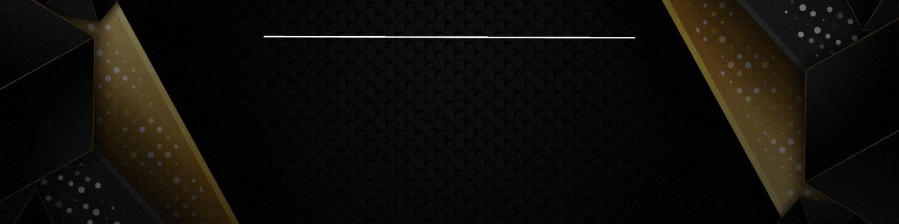

  

#

Estudante de Engenharia da Computação na Universidade Virtual do Estado de São Paulo. Atualmente estou me dedicando a aprimorar meus conhecimento na Cloud AWS. Estou constantemente atualizando meus conhecimentos e buscando novos desafios na área de tecnologia. Tenho paixão por aprender e aplicar esses conhecimentos para criar soluções inovadoras.

#

<h3 align="left">Entre em contato:</h3>

<h3 align="left">Tecnologias que conheço:</h3>

  
  
  
  
  
  
  
  
  
  
  
  
  
  
  
  
  
  

#

### 🌟 Desenvolvedor Full-Stack e entusiasta da tecnologia
- 🚀 Estou procurando um estágio na área de front-end 
- 📚 6º semestre de Engenharia da Computação 
- 🎓 Formado em Processos Gerenciais 
- 🎸 Músico 
- 💻 Amor por tecnologia e muita vontade de contribuir para o mercado  

<picture align="center">
  <source media="(prefers-color-scheme: dark)" srcset="https://raw.githubusercontent.com/will-developer/will-developer/output/github-contribution-grid-snake-dark.svg">
  <source media="(prefers-color-scheme: light)" srcset="https://raw.githubusercontent.com/will-developer/will-developer/output/github-contribution-grid-snake-dark.svg">
  
</picture>
